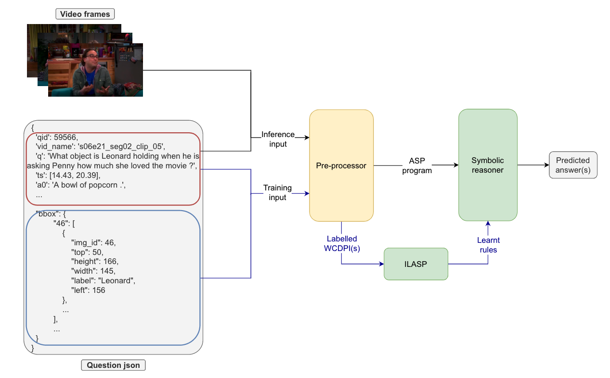
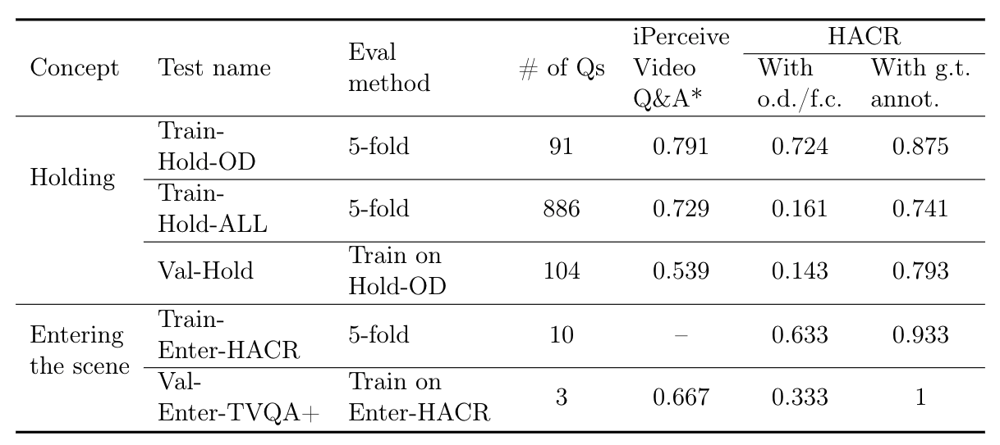

# HACR -- Hybrid Architecture for Concept Reasoning

A hypbrid architecture for learning and reasoning about the concepts of 'holding' and 'entering' from the TVQA+ dataset. Combines power of statistical learning (pre-trained neural models) with symoblic learning and reasoning (Inductive Learning system ILASP and reasoning model ASP).

4th year individual project at Imperial College London.


## Pipeline

Pre-processing

- Object detection: pre-trained Faster R-CNN (`torch`, `torchvision`)

- Face detection + classification: pre-trained Haar cascade model + face-recognition encoding + KNN classifier (`dlib`, `face-recognition-models`, `opencv-python`, `scikit-learn`)

- Abrupt transition detection: K-means cluster (`scikit-learn`) + non-maximum supression

- Dependency parsing: `en_core_sm` from `spacy`

- Synonym, hyponym, hypernym check: `wordnet` from `nltk`

- Unused component - human pose estimation (`human-pose-estimation.pytorch`)

Symbolic learning - `ILASP` version 4

Symbolic reasoning - ASP (`clingo`)



## Running instructions

This project uses CUDA in the neural models. If not having GPU, please change the device in `image_processing.py` to CPU.

You would need all the packages mentioned with the commponents in the **Pipeline** section, except `human-pose-estimation.pytorch`. We do not use the human pose estimator. However, we do provide the code in `human_pos_est`, and if you want to run the module you the git repo cloned in this repo's parent directory, like this:

```
|_ human-pose-estimation.pytorch/
|
|_ hacr/
```

Before running the system, please change the path in `common.py` according to your setup. In particular, the `FRAME_FOLDER` variable, which specifies the location of the TVQA+ dataset.

In `hacr_h.py` and `hacr_e.py`, we have the demonstructions of running 5-fold cross-validation. To run the experiments, simply run the commond:

```
python hacr_h.py
```

or

```
python hacr_e.py
```

## Evaluation result

The evaluation of the pipeline and rule learning is as follows:



Note that when running [iPerceive Video Q&A](https://github.com/amanchadha/iPerceive/tree/master/iPerceiveVideoQA) model, we could not the common-sense reasoning component. According to the evaluation in their original paper, with extra common-sense component enabled, the performance increase around 1%. Thus, the performance of iPerceive without common-sense reasoning component on our dataset should be not be influenced much.

Overall we can see that if using accurate feature extraction our model outperforms the iPerceive Video Q&A.
